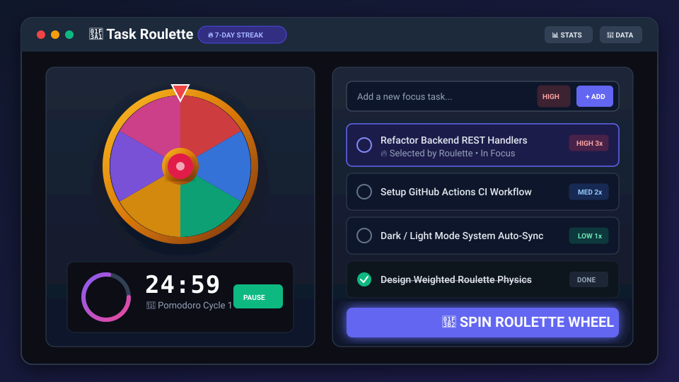

# 🎡 Task Roulette

[](https://github.com/dhirajkumar-09/Task_Roulette/actions/workflows/ci.yml)
[](LICENSE)
[](https://www.oracle.com/java/technologies/javase/jdk17-archive-downloads.html)
[](Dockerfile)
[](https://taskroulette1.vercel.app/)

**Can't decide what to work on? Let the wheel choose.**

Task Roulette is a gamified focus-task manager. Add your tasks, spin the roulette wheel, and the app picks one for you and starts a focus timer. Complete tasks every day to build a streak.

Built with **Java 17** (plain `HttpServer` + SQLite) and **vanilla HTML, CSS and JavaScript**. No frameworks, no npm, no build tools.

🔗 **Live demo:** [https://taskroulette1.vercel.app/](https://taskroulette1.vercel.app/)

---

## 📸 Preview

<p align="center">
  
</p>

---

## 📑 Table of Contents

- [Preview](#-preview)
- [Features](#-features)
- [How It Works](#-how-it-works)
- [Tech Stack](#-tech-stack)
- [Getting Started](#-getting-started)
- [API Reference](#-api-reference)
- [Database](#-database)
- [Deployment](#-deployment)
- [Project Structure](#-project-structure)
- [Roadmap](#-roadmap)
- [Contributing](#-contributing)
- [License](#-license)

---

## ✨ Features

### 🎯 Core
| Feature | Description |
|---|---|
| **Roulette Wheel** | High-DPI canvas wheel with priority-weighted sector arcs (High: 3x, Med: 2x, Low: 1x), smooth deceleration, and pointer landing. It picks a task proportional to its priority and highlights it with an "IN FOCUS" badge. |
| **Focus Timer** | Presets (5, 10, 15, 25 and 45 min) or a custom time, with a circular countdown ring that changes color (purple, amber, red). |
| **Task Management** | Add, complete and delete tasks with priority tags (`HIGH`, `MED`, `LOW`). Filter by All, Active or Completed, and clear all completed tasks at once. |

### 🔥 Progress
| Feature | Description |
|---|---|
| **Streak System** | Tracks current streak, best streak and total completed tasks, based on real completion history. |
| **7-Day Activity Calendar** | Shows which of the last 7 days you completed tasks. |
| **Confetti** | Particle effect when a spin lands or a task is completed. |

### 👤 Users and Data
| Feature | Description |
|---|---|
| **Multi-User Profiles** | Every profile has its own tasks, wheel and streak. Profiles can be renamed. |
| **SQLite Persistence** | All data is stored in `taskroulette.db` and survives server restarts. |
| **Backup Export & Import** | Download tasks and streak history as JSON or CSV (Excel compatible). Import backup files with auto-deduplication and validation. |

### 🎨 Experience
| Feature | Description |
|---|---|
| **Sound Effects** | Wheel ticking, win fanfare and timer chime, created with the Web Audio API. Mute toggle included. |
| **Dark / Light Mode** | Theme toggle, remembered in the browser. |
| **Responsive Design** | Works from large monitors down to 375px phone screens. |
| **Docker Ready** | Multi-stage Dockerfile and automatic `PORT` binding for cloud deployment. |

---

## ⚙️ How It Works

```
 Add tasks ──▶ Spin the wheel ──▶ Task is picked ──▶ Focus timer starts
                                                           │
   Streak grows ◀── Completion is logged ◀── Mark task done ◀┘
```

1. **Add tasks.** Each task is saved to SQLite through the REST API.
2. **Spin.** The wheel picks one active task at random and scrolls to it in the list.
3. **Focus.** Start the timer (preset or custom). A chime plays when time is up.
4. **Complete.** Marking a task done writes an entry to the `completion_log` table.
5. **Streak.** The backend counts consecutive days from the completion log and returns the current streak, best streak and the last 7 days.

Each request carries an `X-User-Id` header, so the backend always returns only that user's data.

---

## 🧰 Tech Stack

| Layer | Technology |
|---|---|
| **Backend** | Java 17, `com.sun.net.httpserver.HttpServer` |
| **Database** | SQLite via `sqlite-jdbc` (3.36.0.3) |
| **Frontend** | HTML5, CSS3, vanilla JavaScript (single page) |
| **Graphics** | HTML Canvas (wheel, confetti), SVG (timer ring) |
| **Audio** | Web Audio API |
| **Browser storage** | `localStorage` for theme and sound preferences |
| **Containers** | Docker (Eclipse Temurin 17, multi-stage build) |
| **Hosting** | Render (backend), Vercel (frontend) |

---

## 🚀 Getting Started

### Prerequisites
- **Java 17 or newer**, or **Docker**

### Option A: Run with Java

```bash
# 1. Compile
javac -cp "lib/sqlite-jdbc.jar" -d out src/TaskRouletteServer.java

# 2. Run on Windows (";" is the separator)
java -cp "out;lib/sqlite-jdbc.jar" --enable-native-access=ALL-UNNAMED TaskRouletteServer

# 2. Run on macOS / Linux (":" is the separator)
java -cp "out:lib/sqlite-jdbc.jar" --enable-native-access=ALL-UNNAMED TaskRouletteServer
```

Then open **http://localhost:8080/**

### Option B: Run with Docker

Run with Docker Compose (includes persistent database volume):
```bash
docker compose up --build
```

Or build and run manually:
```bash
docker build -t task-roulette .
docker run -p 8080:8080 -v taskroulette_data:/app/data task-roulette
```

Then open **http://localhost:8080/**

> The server reads the port from the `PORT` environment variable (default `8080`) and binds to `0.0.0.0`. Persistent database storage is mounted at `/app/data`.

---

## 📡 API Reference

Base URL: `http://localhost:8080`

All endpoints accept an `X-User-Id` header to separate users.

### Tasks

| Method | Endpoint | Body | Description |
|---|---|---|---|
| `GET` | `/api/tasks` | none | List all tasks of the user |
| `POST` | `/api/tasks` | `{"text": "...", "priority": "HIGH\|MED\|LOW"}` | Create a task (priority defaults to `MED`, returns `201 Created`) |
| `PUT` | `/api/tasks/{id}` | `{"completed": true}`, `{"text": "..."}` or `{"priority": "..."}` | Update a task. Completing a task also updates the streak log. |
| `DELETE` | `/api/tasks/{id}` | none | Delete one task |
| `DELETE` | `/api/tasks/completed` | none | Delete all completed tasks |

### Streak

| Method | Endpoint | Description |
|---|---|---|
| `GET` | `/api/streak` | Returns `{ count, bestStreak, completedToday, active, totalCompleted, recentDays: [...] }` |

### Profile

| Method | Endpoint | Body | Description |
|---|---|---|---|
| `GET` | `/api/user` | none | Returns `{ id, name }` |
| `POST` | `/api/user` | `{"name": "..."}` | Update the display name |

### Backup & Restore

| Method | Endpoint | Query / Body | Description |
|---|---|---|---|
| `GET` | `/api/export?format=json` | none | Download tasks and completion streak history as JSON |
| `GET` | `/api/export?format=csv` | none | Download tasks as spreadsheet-compatible CSV |
| `POST` | `/api/import` | JSON or CSV content | Import backup file with automated deduplication |

**Example**

```bash
curl -X POST http://localhost:8080/api/tasks \
  -H "Content-Type: application/json" \
  -H "X-User-Id: demo" \
  -d '{"text": "Study Java", "priority": "HIGH"}'
```

---

## 🗄️ Database

SQLite file: `taskroulette.db` (created automatically on first run).

| Table | Purpose |
|---|---|
| `users` | User profiles (id and display name) |
| `tasks` | Tasks with text, priority (`HIGH`, `MED`, `LOW`), completion state and timestamps |
| `completion_log` | One record for each completed task, used to calculate streaks |

---

## ☁️ Deployment

The live demo runs the frontend on **Vercel** and the Java backend on **Render**.

### Backend on Render (Docker)

1. Open the [Render Dashboard](https://dashboard.render.com/) → **New +** → **Web Service**.
2. Connect this GitHub repository.
3. Set **Environment** to `Docker`, **Branch** to `main`, and pick a plan.
4. Click **Create Web Service**. Render builds the `Dockerfile` and starts the app.

The repository also includes a `render.yaml` file for Render configuration.

### Frontend on Vercel

1. Import the repository in [Vercel](https://vercel.com/).
2. Set **Root Directory** to `static` and **Framework Preset** to `Other`.
3. Make sure `/api/*` requests reach the Render backend (see `vercel.json`).

> ⚠️ On Render's free plan the server sleeps after a period of inactivity (the first load can take about a minute), and the SQLite file may reset on restart because the disk is temporary.

---

## 📁 Project Structure

```
Task_Roulette/
├── .github/
│   └── workflows/
│       └── ci.yml                # Automated compilation & API smoke test workflow
├── docs/
│   └── preview.svg               # Application visual preview vector diagram
├── src/
│   └── TaskRouletteServer.java   # Backend: HTTP server, SQLite access, JSON handling
├── static/
│   └── index.html                # Frontend: single-page app (HTML, CSS, JS)
├── lib/
│   └── sqlite-jdbc.jar           # SQLite JDBC driver
├── Dockerfile                    # Multi-stage Docker build (Eclipse Temurin 17)
├── docker-compose.yml            # Docker Compose orchestration with persistent SQLite volume
├── .dockerignore                 # Files excluded from the Docker build
├── render.yaml                   # Render deployment configuration
├── vercel.json                   # Vercel configuration
├── ISSUES.md                     # Planned features and issue descriptions
├── PROGRESS.md                   # Development log
├── LICENSE                       # MIT License
├── .gitignore
└── README.md
```

---

## 🗺️ Roadmap

Planned features are tracked in the [Issues](https://github.com/dhirajkumar-09/Task_Roulette/issues) tab (descriptions are also in [`ISSUES.md`](ISSUES.md)).

- [x] Task priority and tags (High, Medium, Low)
- [x] Weighted roulette wheel based on priority
- [ ] Prevent duplicate task names
- [ ] Edit task text directly in the list
- [ ] Pomodoro cycle with short and long breaks
- [ ] Browser notification when the focus timer ends
- [ ] Keyboard shortcuts
- [ ] Sound themes and a volume slider
- [ ] Auto-sync theme with the system dark/light preference
- [x] Export and import tasks (JSON / CSV)
- [ ] Productivity stats and heatmap calendar
- [ ] Rate limiting and input sanitization
- [ ] `docker-compose.yml` for one-command setup
- [ ] GitHub Actions CI (build and API smoke tests)

---

## 🤝 Contributing

Contributions are warmly welcome! Whether you are fixing a bug, adding an enhancement, or polishing documentation, here is how you can help:

1. **Fork** the repository to your GitHub account.
2. **Clone** your fork locally:
   ```bash
   git clone https://github.com/YOUR_USERNAME/Task_Roulette.git
   cd Task_Roulette
   ```
3. **Pick an issue** from the [Issues](https://github.com/dhirajkumar-09/Task_Roulette/issues) tab.
4. **Create a topic branch**:
   ```bash
   git checkout -b feature/issue-name
   ```
5. **Develop and verify**:
   ```bash
   # Compile Java backend
   javac -cp "lib/sqlite-jdbc.jar" -d out src/TaskRouletteServer.java
   ```
6. **Commit with a descriptive message**:
   ```bash
   git commit -m "feat: descriptive title (fixes #12)"
   ```
7. **Push and open a Pull Request**: Submit your PR targeting `main` with a clear explanation of changes.

---

## 📄 License

This project is open-source and licensed under the [MIT License](LICENSE).
See the [`LICENSE`](LICENSE) file for complete terms.

